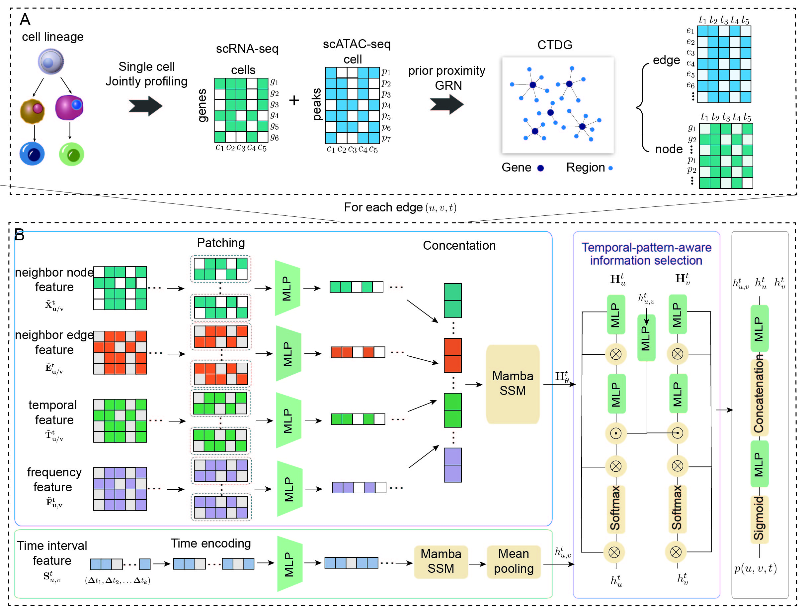

# DRIMA

DRIMA is a tool for dynamic regulatory inference from jointly profiled single-cell multi-omics data.

DRIMA takes cell-matched scRNA-seq, scATAC-seq, and pseudotime as its primary
inputs. It converts regulatory events into a continuous-time dynamic graph
(CTDG) and uses a DyGMamba-based model to predict dynamic TF-region,
region-gene, and TF-gene relationships.



## Directory structure

```text
.
|-- code/
|   |-- dygmamba/       # Core CTDG construction and DRIMA model
|   |-- benchmark/      # Benchmark methods and evaluation
|   |-- case1/          # BMMC differentiation analyses
|   |-- case2/          # Alzheimer's disease analyses
|   `-- case3/          # Cross-tissue analyses
`-- README.md
```

Core implementation:

```text
code/dygmamba/src/
|-- models/             # DRIMA model, training, and inference
|-- pdata/              # Single-cell and prior-network processing
|-- self_utils/         # CTDG construction utilities
|-- utils/              # Data loaders, samplers, and configuration
|-- dygmamba_preprocess.py
|-- main_data_process.py
`-- trajectory_inference.R
```

## Installation

> Installation in a dedicated conda environment is recommended.

DRIMA follows the core environment of
[ZifengDing/DyGMamba](https://github.com/ZifengDing/DyGMamba) and adds
single-cell, genomic, and plotting packages used by this repository.

```bash
conda create -n drima python=3.9 pip -y
conda activate drima

python -m pip install --upgrade pip setuptools wheel packaging ninja

python -m pip install \
  numpy==1.25.2 \
  pandas==1.5.3 \
  torch==2.2.0 \
  tqdm==4.66.2 \
  tabulate

python -m pip install mamba-ssm==1.2.0 --no-build-isolation

python -m pip install \
  "scipy<1.12" \
  "scikit-learn<1.4" \
  "scanpy<1.10" \
  "anndata<0.10" \
  "muon<0.2" \
  "networkx<3.3" \
  "h5py<3.11" \
  "matplotlib<3.9" \
  "seaborn<0.14" \
  gtfparse pyranges pybedtools pyfaidx hic-straw \
  dill openpyxl jupyterlab ipykernel
```

Install a PyTorch build that matches the CUDA driver on the target machine.
The compilation of `mamba-ssm` requires a compatible CUDA toolkit and compiler.

Expose the local package from the repository root:

```bash
export PROJECT_ROOT="$(pwd)"
export PYTHONPATH="$PROJECT_ROOT/code/dygmamba/src:$PYTHONPATH"
```

BEDTools is required when genomic intervals are generated or processed:

```bash
sudo apt-get install bedtools
```

## Usage

### Input data

The user-provided biological inputs are:

1. a cell-by-gene scRNA-seq AnnData object;
2. a cell-by-region scATAC-seq AnnData object;
3. a pseudotime table for the same cells.

Use the following dataset layout:

```text
my_dataset/
|-- input/
|   |-- rna_processed.h5ad
|   |-- atac_processed.h5ad
|   |-- pseudotime.csv
|   |-- binary_peak_gene_rp_network.h5ad
|   `-- binary_peak_peak_rp_network.h5ad
`-- ctdg/
```

`pseudotime.csv` must contain:

```text
cell_barcode,pseudotime
AAAC...,0.0000
AAAG...,0.0132
```

RNA, ATAC, and pseudotime must share cell barcodes. RNA variable names should
be gene identifiers, while ATAC variable names should be genomic regions.

The two regulatory-potential files are structural intermediates derived from
RNA, ATAC, and genome annotation. They are not additional single-cell
measurements. See the appendix if these files or pseudotime are unavailable.

### 1. Construct the CTDG

Open `code/dygmamba/src/dygmamba_preprocess.py` and set:

```python
data_path = "/absolute/path/to/my_dataset/input/"
output_path = "/absolute/path/to/my_dataset/ctdg/"
sub_set = False
```

Use the standard pseudotime file:

```python
pseudotime = pd.read_csv(data_path + "pseudotime.csv")
```

Then run:

```bash
python code/dygmamba/src/dygmamba_preprocess.py
```

The script aligns cells across modalities, assigns pseudotime, constructs the
CTDG, and writes:

```text
my_dataset/ctdg/
|-- Graph_df.pkl
|-- node_id.pkl
|-- node_feature_data.pkl
|-- edge_features.npy
|-- edge_labels.npy
`-- edge_records_data.pkl
```

### 2. Train DRIMA

Open `code/dygmamba/src/models/main_train_hpc.py` and set `data_path` to the
same CTDG directory:

```python
data_path = "/absolute/path/to/my_dataset/ctdg/"
```

Run training on GPU 0:

```bash
python code/dygmamba/src/models/main_train_hpc.py \
  --model_name DyGMamba \
  --dataset_name mooc \
  --gpu 0
```

The current argument parser inherits hyperparameter presets from upstream
DyGMamba. `--dataset_name` selects a supported preset and output label; the
biological data are always loaded from `data_path`. Use `mooc` as the default
preset, or add a dataset-specific preset in
`code/dygmamba/src/utils/load_configs.py`.

Training writes logs, checkpoints, link predictions, and inferred dynamic
regulatory networks under the configured CTDG directory.

## Reproducing project analyses

The main figure notebooks are:

```text
Benchmark: code/benchmark/All_V3_2.ipynb
Case 1:    code/case1/Final.ipynb
Case 2:    code/case2/AD_ana.ipynb
Case 3:    code/case3/Ana_V8.ipynb
```

These analyses use large datasets and are not intended as the introductory
usage example. Run them only after preparing the corresponding project data
and updating their absolute paths.

Figure source data can be exported with
`code/plot_data_excel_export.py`. The available entry points are
`export_benchmark`, `export_case1`, `export_case2`, and `export_case3`.

## Appendix: Preparing missing inputs

This section is only needed when processed AnnData objects,
regulatory-potential matrices, or pseudotime are not already available.

### A. Prepare paired AnnData objects

Convert the user's count matrices to:

```text
rna_origin.h5ad
atac_origin.h5ad
```

Both objects must store cells in observations. RNA variables must represent
genes, ATAC variables must represent genomic regions, and cell barcodes must be
compatible between modalities. Sparse matrices are recommended.

### B. Generate genome annotation

Set a GTF annotation matching the reference genome:

```bash
export DATASET_DIR="/absolute/path/to/my_dataset"
export GTF_FILE="/absolute/path/to/annotation.gtf"

python - <<'PY'
import os
from pdata.data_read import read_genenotation

root = os.environ["DATASET_DIR"]
gtf = read_genenotation(os.environ["GTF_FILE"])
gtf.to_pickle(os.path.join(root, "input", "gene_info_data.pkl"))
PY
```

### C. Preprocess RNA/ATAC and build structural priors

Use `code/dygmamba/src/main_data_process.py` as the preprocessing entry point.
Set its input/output path to `/absolute/path/to/my_dataset/input/`, then run:

```bash
python code/dygmamba/src/main_data_process.py
```

For the core DRIMA workflow, retain the RNA, ATAC, regulatory-potential, and
R-export blocks. JASPAR, ChIP-seq, Hi-C, and benchmark-only blocks can be
disabled when those optional reference datasets are unavailable.

The required outputs are:

```text
rna_processed.h5ad
atac_processed.h5ad
binary_peak_gene_rp_network.h5ad
binary_peak_peak_rp_network.h5ad
R/rna/sparse.mtx
R/rna/cellinfo.csv
R/rna/rnainfo.csv
R/atac/sparse.mtx
R/atac/cellinfo.csv
R/atac/atacinfo.csv
```

### D. Infer pseudotime

Trajectory inference is optional if the user already has pseudotime. The
included implementation uses
[Seurat](https://satijalab.org/seurat/),
[Slingshot](https://bioconductor.org/packages/slingshot/), and
`SingleCellExperiment`.

Install the R dependencies:

```r
install.packages(c(
  "Seurat", "Matrix", "data.table", "tidyverse",
  "cowplot", "patchwork", "RColorBrewer", "arrow"
))

if (!requireNamespace("BiocManager", quietly = TRUE)) {
  install.packages("BiocManager")
}

BiocManager::install(c(
  "slingshot", "SingleCellExperiment", "S4Vectors"
))
```

In `code/dygmamba/src/trajectory_inference.R`, set:

- `data_path` to the dataset input directory;
- `clusterLabels` to the appropriate cluster or cell-type annotation;
- `start.clus` to a biologically justified root cluster;
- `output_filename` to `pseudotime.csv`.

Run:

```bash
Rscript code/dygmamba/src/trajectory_inference.R
```

Any trajectory-inference method can be substituted for Slingshot if it
produces a CSV with `cell_barcode` and numeric `pseudotime` columns.

